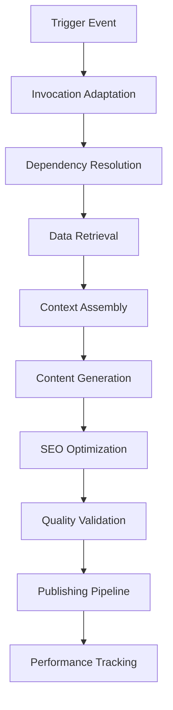

# Technical Specification: Enterprise SEO Content Generation Pipeline

## Mission Statement

Design and implement a comprehensive N8N workflow ecosystem that generates high-authority, AI-optimized content following a strategic pillar-silo-subsilo architecture to achieve #1 SERP rankings across traditional and AI-powered search systems.

## System Architecture Overview

### Core Workflow Ecosystem
The system consists of one primary workflow orchestrating multiple specialized secondary workflows, each designed as modular, reusable components following the Universal Workflow Design Strategy outlined in `SYSTEM.md`.

### Primary Workflow: Content Generation & Publishing Pipeline
**Objective**: Generate, optimize, and publish SEO content that outranks local competition while targeting AI-powered search agents as the primary audience.

### Secondary Workflows (Dependencies)
1. **SEO Strategy Generator** - Competitive analysis and content strategy formulation
2. **Business Profile Generator** - Company context and positioning documentation
3. **Brand Voice Analyzer** - Brand personality and communication style definition
4. **Audience Intelligence Generator** - Target audience analysis and persona development
5. **Content Cluster Planner** - Pillar-silo-subsilo content architecture planning
6. **Competitive Intelligence Analyzer** - SERP analysis and competitor content gaps

## Deliverable Requirements

All workflows must be delivered as:
1. **N8N Export Files**: Complete JSON workflow exports ready for import (see `EXPORT-N8N.md`)
2. **Mermaid Diagrams**: Visual workflow representations for documentation
3. **Documentation**: Comprehensive setup and configuration guides
4. **Test Data**: Sample data sets for workflow validation


## Content Quality Framework

### AI Search Optimization Standards
- **Entity-Rich Content**: Minimum 15 relevant entities per 1000 words
- **Semantic Depth**: Topic coverage breadth score >85%
- **Answer Optimization**: Direct answers to common questions within first 100 words
- **Citation Readiness**: Structured data markup for AI citation extraction

### Technical SEO Requirements
- **Core Web Vitals**: LCP <2.5s, FID <100ms, CLS <0.1
- **Mobile Optimization**: Perfect mobile usability score
- **Structured Data**: Comprehensive schema markup implementation
- **Internal Linking**: Strategic link architecture supporting topical authority

### Content Performance Metrics
- **Topical Authority Score**: Calculated based on content depth and entity coverage
- **Search Intent Alignment**: Match percentage with target search intent
- **Competitive Advantage**: Unique value proposition strength vs. competitors
- **Conversion Potential**: Likelihood of driving target user actions

## Workflow Design Architecture

### Universal Workflow Pattern (as defined in SYSTEM.md)
All workflows follow the standardized 11-stage execution pattern:

1. **Adapt Invocation Parameters** - Standardize input data
2. **Retrieve Required Data** - Fetch dependency documents/data
3. **Transform Data** - Adapt retrieved data to workflow interface
4. **Create WorkflowData** - Combine all inputs into standardized object
5. **Validate WorkflowData** - Ensure data integrity and completeness
6. **Update State** - Log execution progress
7. **Execute Primary Objective** - Perform core workflow function
8. **Store Results** - Persist generated data and outputs
9. **Log Execution** - Record performance and outcome metrics
10. **Execute Callback** - Trigger dependent workflows or notifications
11. **Return Results** - Provide standardized output response


## Detailed Workflow Specifications

### 1. Primary Workflow: Content Generation & Publishing Pipeline

#### Stage 1: Invocation Parameter Adaptation
**Node**: `Adapt_InvocationInput`
- **Input**: Raw invocation parameters from trigger
- **Process**: Standardize and validate input parameters
- **Output**: Structured `InvocationData` object

```typescript
interface InvocationData {
  targetKeyword: string;
  contentType: 'PILLAR' | 'SILO' | 'SUB_SILO';
  targetLocation?: string;
  publishingSchedule: 'IMMEDIATE' | 'SCHEDULED';
  scheduledDate?: string;
  contentStrategyId: string;
}
```

#### Stage 2: Dependency Resolution & Data Retrieval
**Nodes**: 
- `Retrieve_ContentStrategy`
- `Retrieve_BusinessProfile` 
- `Retrieve_BrandProfile`
- `Retrieve_AudienceProfiles`
- `Retrieve_CompetitorAnalysis`

**Process**: Parallel retrieval of all required context documents from Airtable/Outline storage

#### Stage 3: Content Generation Orchestration
**Primary Objective**: Generate high-authority content optimized for AI search systems

**Execution Sequence**:
1. **Content Research** - Gather supporting research and data
2. **Content Outline** - Generate structured content outline
3. **Content Drafting** - AI-powered content generation
4. **SEO Optimization** - Technical SEO optimization
5. **Quality Assurance** - Content quality validation

#### Stage 4: Metadata Generation
**Node**: `Execute_MetadataGeneration`
- Generate optimized title tags (50-60 characters)
- Create compelling meta descriptions (150-160 characters)
- Generate Open Graph tags for social sharing
- Create JSON-LD structured data markup
- Generate alt text for images

#### Stage 5: Content Publishing & Distribution
**Nodes**:
- `Execute_ContentPublishing` - WordPress multisite publishing
- `Execute_SocialDistribution` - Social media cross-posting
- `Execute_IndexingRequest` - Google Search Console indexing request

### 2. Secondary Workflow: SEO Strategy Generator

#### Primary Objective
Analyze target keywords in the format `{ServiceOffering} in {TargetCity}` and generate comprehensive competitive intelligence to inform content strategy parameters.

#### Key Outputs
```typescript
interface SEOStrategy {
  keywords: Array<{
    keyword: string;
    searchVolume: number;
    difficulty: number;
    intent: 'informational' | 'commercial' | 'transactional' | 'navigational';
    competitorCount: number;
    averageWordCount: number;
    topRankingFeatures: string[];
  }>;
  contentArchitecture: {
    pillarsCount: number;
    silosPerPillar: number;
    subSilosPerSilo: number;
    totalArticlesRequired: number;
  };
  publishingStrategy: {
    frequency: 'daily' | 'weekly' | 'bi-weekly';
    pillarToSiloRatio: string;
    siloToSubSiloRatio: string;
    rotationPattern: string[];
  };
}
```

#### Content Strategy Mathematics
**Formula**: P(pillars) × S(silos per pillar) × SS(sub-silos per silo) = Total Articles
**Example**: 5 Pillars × 5 Silos × 5 Sub-Silos = 125 Total Articles

**Publishing Rotation Algorithm**:
1. Publish 1 Pillar article
2. Publish 3-5 supporting Silo articles
3. Publish 2-3 Sub-Silo articles per Silo
4. Return to next Pillar topic
5. Repeat cycle with content refresh strategy

### 3. Secondary Workflow: Business Profile Generator

#### Primary Objective
Generate comprehensive business context documentation for content personalization and brand alignment.

#### Key Outputs
```typescript
interface BusinessProfile {
  company: {
    name: string;
    industry: string;
    serviceAreas: string[];
    uniqueValuePropositions: string[];
    targetMarkets: string[];
  };
  expertise: {
    coreServices: string[];
    specializations: string[];
    certifications: string[];
    yearsInBusiness: number;
    teamSize: number;
  };
  competitive: {
    differentiators: string[];
    marketPosition: string;
    pricingStrategy: string;
    serviceQuality: string;
  };
}
```

### 4. Secondary Workflow: Brand Voice Analyzer

#### Primary Objective
Define and document brand personality, tone, and communication style for consistent content generation.

### 5. Secondary Workflow: Audience Intelligence Generator

#### Primary Objective
Analyze target audience segments and create detailed personas for content targeting and optimization.


## Data Storage & Integration Architecture

### Primary Data Sources
- **Airtable**: Structured data storage for strategies, profiles, and content metadata
- **Outline.com**: Document storage for generated profiles and content
- **WordPress Multisite**: Content publishing and distribution hub
- **Google APIs**: Search Console, Analytics, PageSpeed Insights integration

### Data Flow Architecture


## Advanced Features & Optimizations

### AI-Powered Content Enhancement
- **Dynamic Content Personalization**: Real-time content adaptation based on user signals
- **Semantic Content Expansion**: AI-driven topic expansion and entity enrichment
- **Competitive Content Analysis**: Real-time competitor content monitoring and gap analysis
- **Performance-Based Optimization**: Automatic content updates based on performance metrics

### Workflow Orchestration Features
- **Dependency Management**: Intelligent workflow scheduling based on data dependencies
- **Error Recovery**: Automatic retry mechanisms with exponential backoff
- **Performance Monitoring**: Real-time workflow execution monitoring and alerting
- **A/B Testing Integration**: Built-in content variation testing and optimization

## Success Metrics & KPIs

### Primary Success Indicators
- **SERP Position**: Target #1 ranking achievement rate
- **Organic Traffic Growth**: Month-over-month organic traffic increase
- **Topical Authority**: Domain authority improvement in target topics
- **Content Performance**: Average time on page, bounce rate, conversion rate

### Operational Metrics
- **Workflow Execution Time**: Average time from trigger to publication
- **Content Quality Score**: Automated content quality assessment
- **Error Rate**: Workflow failure and retry rates
- **Resource Utilization**: API call efficiency and cost optimization

## Content Strategy Taxonomy

### Content Type Definitions
- **Pillar Content**: Comprehensive, authoritative content covering broad topics (e.g., "Commercial HVAC Services & Solutions")
- **Silo Content**: Focused content supporting pillar topics with specific contexts (e.g., "Commercial HVAC System Installation & Upgrades")
- **Sub-Silo Content**: Highly specific, long-tail content for conversion optimization (e.g., "HVAC System Sizing for Multi-Zone Commercial Buildings in McKinney")

### Keyword Strategy
- **Target Format**: `{ServiceOffering} in {TargetCity}`
- **Example**: "Commercial HVAC in McKinney TX"
- **Intent Mapping**: Each content type aligns with specific search intents (informational, commercial, transactional)


## Implementation Guidelines

### Development Principles
- **Modularity First**: Design workflows as independent, reusable components
- **Performance Optimization**: Minimize API calls and optimize data processing
- **Error Resilience**: Implement comprehensive error handling and recovery mechanisms
- **Scalability**: Design for high-volume content generation and processing

### N8N Best Practices
- **Node Naming**: Use descriptive, stage-prefixed node names (see SYSTEM.md)
- **Variable Management**: Implement consistent variable naming and scoping
- **Documentation**: Include inline documentation for complex logic
- **Testing**: Provide test data and validation scenarios

### Quality Assurance Requirements
- **Content Validation**: Multi-layer content quality checks
- **SEO Compliance**: Automated SEO best practice validation
- **Performance Monitoring**: Real-time execution monitoring and alerting
- **Data Integrity**: Comprehensive data validation and error handling

## Risk Mitigation & Contingency Planning

### Technical Risks
- **API Rate Limiting**: Implement intelligent queuing and fallback mechanisms
- **Content Quality Issues**: Multi-layer quality validation and human review triggers
- **Performance Degradation**: Automated scaling and resource optimization

### Business Risks
- **Algorithm Changes**: Flexible content strategy adaptation mechanisms
- **Competitive Response**: Continuous competitive monitoring and strategy adjustment
- **Content Saturation**: Dynamic content differentiation and unique angle generation

